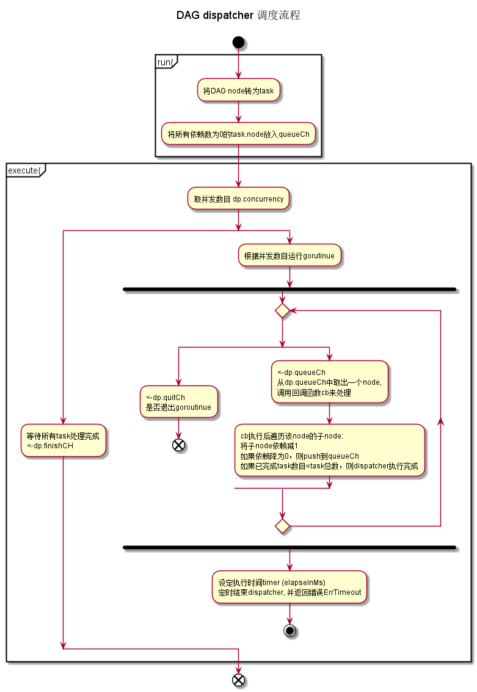

## common\dag\dag.go


### 功能描述
Dispatcher 调度器按照指定的并发度,按照DAG指定的依赖关系,执行block中的交易。


### 主要数据结构

```golang

// Dispatcher struct a message dispatcher dag.
type Dispatcher struct {
	concurrency      int            //调度器Dispatcher的并发度
	cb               Callback       //回调函数, 每个node(即transaction)的具体执行者
	muTask           sync.Mutex
	dag              *Dag           //需要执行调度的DAG.
	elapseInMs       int64          //Dispatcher的最大执行时间, 超时后退出。 目前该参数设为0(不限时)。
	quitCh           chan bool      //用来退出执行task的goroutinue.(当所有task执行完或出现错误,会调用Dispatcher.stop(),此时用到quitCh.)
	queueCh          chan *Node     //需要处理的node队列，只有当node的依赖执行完后才会放入该队列
	tasks            map[interface{}]*Task
	queueCounter     int            //统计放入queueCh的node数目，
	completedCounter int            //统计已完成的task数目,当该数目等于DAG节点数,说明已完成所有任务. 如果大于节点数,说明DAG存在环!
	isFinsih         bool           //
	finishCH         chan bool      //结束channel。用来退出Dispatcher主函数。
	context          interface{}    //上下文，作为Callback的参数
}

// Task：将DAG中的每个node封装成Task,
type Task struct {
	dependence int      //task的依赖数, 即Node的父节点数目
	node       *Node    //该task要处理的DAG节点node
}
```

### 流程图
Dispatcher 调度流程


