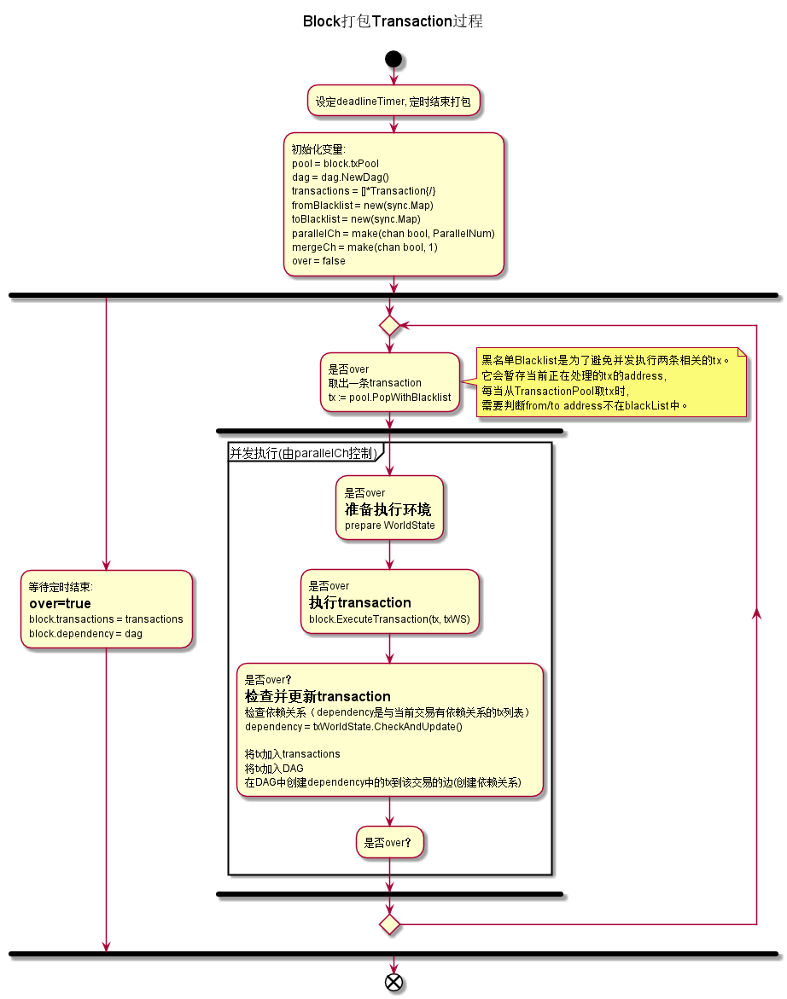
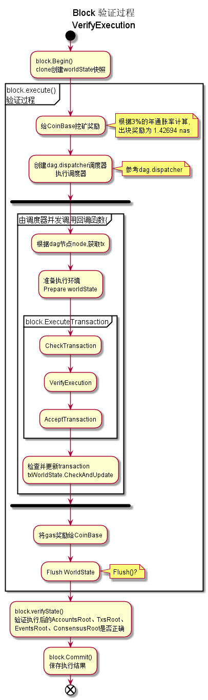

## core\block.go


### 功能描述


其主要功能有:

-

### 主要数据结构


```golang

// Block structure
type Block struct {
	header       *BlockHeader
	transactions Transactions
	dependency   *dag.Dag

	sealed bool
	height uint64  //block 高度

	worldState state.WorldState  //

	txPool       *TransactionPool //
	eventEmitter *EventEmitter //
	nvm          NVM
	storage      storage.Storage
}
```

### 流程图

Block打包transaction的流程



Block验证的流程




