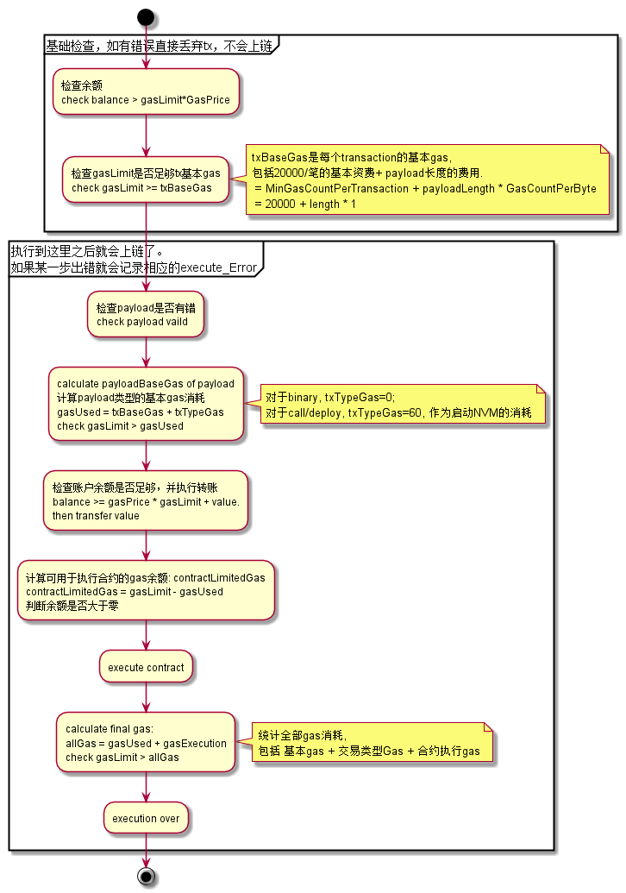

## core/transaction.go


### 功能描述 


其主要功能有:

- `ToProto/FromProto` Transaction的序列化/反序列化(protobuf格式). 
- `GasCountOfTxBase` 计算当前transaction的gas消耗, 包括"tx最小gas" + "数据长度消耗的gas"
- `Sign` 对transaction进行签名.
- `VerifyIntegrity` 验证transaction完整性, 包括验证chainId、hash、签名是否正确.

- `VerifyExecution` 验证transaction的执行过程. 在block的验证，或xinblock的打包过程中会被执行。.
- 
 
### 主要数据结构
```golang
// Transaction type is used to handle all transaction data.
type Transaction struct {
	hash      byteutils.Hash
	from      *Address
	to        *Address
	value     *util.Uint128
	nonce     uint64
	timestamp int64
	data      *corepb.Data
	chainID   uint32
	gasPrice  *util.Uint128
	gasLimit  *util.Uint128

	// Signature
	alg  keystore.Algorithm
	sign byteutils.Hash // Signature values
}
```
### 流程图

transaction 执行流程:


